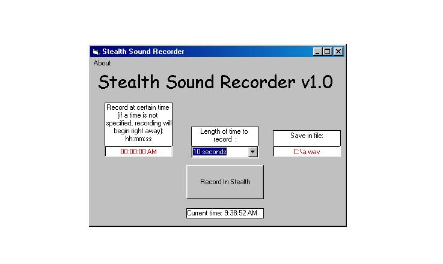



## Stealth Sound Recorder

### Description

This is a good stealth sound recorder with an easy to use interface. When given the time to run and/or for how long to run, the program runs without the user knowing it! Good for monitoring your computer and whose on it.
 
### More Info
 

             |
---                |---
**Submitted On**   |2001-07-12 04:42:22
**By**             |[crazy1031](https://github.com/Planet-Source-Code/PSCIndex/blob/master/ByAuthor/crazy1031.md)
**Level**          |Intermediate
**User Rating**    |4.5 (27 globes from 6 users)
**Compatibility**  |VB 3\.0, VB 4\.0 \(16\-bit\), VB 5\.0, VB 6\.0
**Category**       |[Sound/MP3](https://github.com/Planet-Source-Code/PSCIndex/blob/master/ByCategory/sound-mp3__1-45.md)
**World**          |[Visual Basic](https://github.com/Planet-Source-Code/PSCIndex/blob/master/ByWorld/visual-basic.md)
**Archive File**   |[Stealth So226627122001\.zip](https://github.com/Planet-Source-Code/crazy1031-stealth-sound-recorder__1-24830/archive/master.zip)

